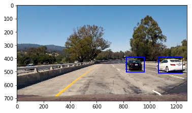
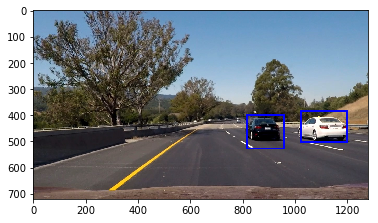

# Vehicle Detection and Tracking

In this project I am demonstrating computer vision techniques for vehicle detection and tracking. Please see TrainModel.ipynb for training model part and TestModel.ipynb for running model on video stream part.


```python
# Importing required libraries

import pickle
import cv2
import numpy as np
import matplotlib.pyplot as plt
import matplotlib.image as mpimg
import glob
from moviepy.editor import VideoFileClip
from IPython.display import HTML
import random
from sklearn.utils import shuffle
from sklearn.model_selection import train_test_split
from sklearn import svm
from sklearn.preprocessing import StandardScaler
from skimage.feature import hog
from sklearn.model_selection import GridSearchCV
import time
from scipy.ndimage.measurements import label
from queue import Queue

%matplotlib inline
print('Library import successful')
```

    Library import successful


```python
# extracting HOG features
def get_hog_features(img, orient, pix_per_cell, cell_per_block, 
                        vis=False, feature_vec=True):
    # Call with two outputs if vis==True
    if vis == True:
        features, hog_image = hog(img, orientations=orient, pixels_per_cell=(pix_per_cell, pix_per_cell),
                                  cells_per_block=(cell_per_block, cell_per_block), block_norm= 'L2-Hys',
                                  transform_sqrt=True, 
                                  visualise=vis, feature_vector=feature_vec)
        return features, hog_image
    # Otherwise call with one output
    else:      
        features = hog(img, orientations=orient, pixels_per_cell=(pix_per_cell, pix_per_cell),
                       cells_per_block=(cell_per_block, cell_per_block), block_norm= 'L2-Hys',
                       transform_sqrt=True, 
                       visualise=vis, feature_vector=feature_vec)
        return features
```


```python
def bin_spatial(img, size=(32, 32)):
    color1 = cv2.resize(img[:,:,0], size).ravel()
    color2 = cv2.resize(img[:,:,1], size).ravel()
    color3 = cv2.resize(img[:,:,2], size).ravel()
    return np.hstack((color1, color2, color3))
                        
def color_hist(img, nbins=32):    #bins_range=(0, 256)
    # Compute the histogram of the color channels separately
    channel1_hist = np.histogram(img[:,:,0], bins=nbins)
    channel2_hist = np.histogram(img[:,:,1], bins=nbins)
    channel3_hist = np.histogram(img[:,:,2], bins=nbins)
    # Concatenate the histograms into a single feature vector
    hist_features = np.concatenate((channel1_hist[0], channel2_hist[0], channel3_hist[0]))
    # Return the individual histograms, bin_centers and feature vector
    return hist_features
```


```python
def convert_color(img, conv='RGB2YCrCb'):
    if conv == 'RGB2YCrCb':
        return cv2.cvtColor(img, cv2.COLOR_RGB2YCrCb)
    if conv == 'BGR2YCrCb':
        return cv2.cvtColor(img, cv2.COLOR_BGR2YCrCb)
    if conv == 'RGB2LUV':
        return cv2.cvtColor(img, cv2.COLOR_RGB2LUV)
```


```python
# Define a function to extract features from a list of images
def extract_features(imgs, cspace='RGB', orient=9, 
                        pix_per_cell=8, cell_per_block=2, hog_channel=0):
    # Create a list to append feature vectors to
    features = []
    # Iterate through the list of images
    for file in imgs:
        # Read in each one by one
        image = mpimg.imread(file)
        # apply color conversion if other than 'RGB'
        if cspace != 'RGB':
            if cspace == 'HSV':
                feature_image = cv2.cvtColor(image, cv2.COLOR_RGB2HSV)
            elif cspace == 'LUV':
                feature_image = cv2.cvtColor(image, cv2.COLOR_RGB2LUV)
            elif cspace == 'HLS':
                feature_image = cv2.cvtColor(image, cv2.COLOR_RGB2HLS)
            elif cspace == 'YUV':
                feature_image = cv2.cvtColor(image, cv2.COLOR_RGB2YUV)
            elif cspace == 'YCrCb':
                feature_image = cv2.cvtColor(image, cv2.COLOR_RGB2YCrCb)
        else: feature_image = np.copy(image)      

        # Call get_hog_features() with vis=False, feature_vec=True
        if hog_channel == 'ALL':
            hog_features = []
            for channel in range(feature_image.shape[2]):
                hog_features.append(get_hog_features(feature_image[:,:,channel], 
                                    orient, pix_per_cell, cell_per_block, 
                                    vis=False, feature_vec=True))
            hog_features = np.ravel(hog_features)        
        else:
            hog_features = get_hog_features(feature_image[:,:,hog_channel], orient, 
                        pix_per_cell, cell_per_block, vis=False, feature_vec=True)
        # Append the new feature vector to the features list
        features.append(hog_features)
    # Return list of feature vectors
    return features
```


```python
def add_heat(heatmap, bbox_list):
    # Iterate through list of bboxes
    for box in bbox_list:
        # Add += 1 for all pixels inside each bbox
        # Assuming each "box" takes the form ((x1, y1), (x2, y2))
        heatmap[box[0][1]:box[1][1], box[0][0]:box[1][0]] += 1

    # Return updated heatmap
    return heatmap# Iterate through list of bboxes

def remove_heat(heatmap, bbox_list):
    # Iterate through list of bboxes
    for box in bbox_list:
        # Add += 1 for all pixels inside each bbox
        # Assuming each "box" takes the form ((x1, y1), (x2, y2))
        heatmap[box[0][1]:box[1][1], box[0][0]:box[1][0]] -= 1

    # Return updated heatmap
    return heatmap# Iterate through list of bboxes
    
def apply_threshold(heatmap, threshold):
    # Zero out pixels below the threshold
    heatmap[heatmap <= threshold] = 0
    # Return thresholded map
    return heatmap
```


```python
def draw_labeled_bboxes(img, labels):
    # Iterate through all detected cars
    for car_number in range(1, labels[1]+1):
        # Find pixels with each car_number label value
        nonzero = (labels[0] == car_number).nonzero()
        # Identify x and y values of those pixels
        nonzeroy = np.array(nonzero[0])
        nonzerox = np.array(nonzero[1])
        # Define a bounding box based on min/max x and y
        bbox = ((np.min(nonzerox), np.min(nonzeroy)), (np.max(nonzerox), np.max(nonzeroy)))
        # Draw the box on the image
        cv2.rectangle(img, bbox[0], bbox[1], (0,0,255), 6)
    # Return the image
    return img
```


```python
# Reading data

vehicle_images = glob.glob('data/vehicles/*/*.png')
non_vehicle_images = glob.glob('data/non-vehicles/*/*.png')

cars = []
notcars = []
for image in vehicle_images:
    cars.append(image)
    
for image in non_vehicle_images:
    notcars.append(image)
    
print('number of car samples: ', len(cars))
print('number of non-car samples: ', len(notcars))
```

    number of car samples:  8792
    number of non-car samples:  8968


```python
colorspace = 'YCrCb' # Can be RGB, HSV, LUV, HLS, YUV, YCrCb
orient = 18
pix_per_cell = 16
cell_per_block = 4
hog_channel = 'ALL' # Can be 0, 1, 2, or "ALL"
```

### 1. Extract HOG features:

Here I am extracting HOG features from training using YCrCb color space, all color channels, 18 orientations, 16x16 pixels per cell and 4x4 cells per block. After Trying couple of color spaces and different values for orientations, pixels per cell and cells per block (e.g. YUV, 9 orientations, 8x8 pixels per cell and 2x2 cells per block), I settled on above set of parameters.


```python
car = mpimg.imread(cars[34])

features, hog_image = get_hog_features(car[:,:,0] , orient, pix_per_cell, cell_per_block, vis=True, feature_vec=True)
plt.imshow(car)
plt.figure()
plt.imshow(hog_image)
plt.figure()
print('Hog features for car image')
```

    Hog features for car image


    <matplotlib.figure.Figure at 0x7f0d13b99390>


```python
notcar = mpimg.imread(notcars[10])
features, hog_image = get_hog_features(notcar[:,:,0], orient, pix_per_cell, cell_per_block, 
                        vis=True, feature_vec=True)

plt.imshow(notcar)
plt.figure()
plt.imshow(hog_image)
plt.figure()
print('Hog features for non-car image')
```

    Hog features for non-car image


    <matplotlib.figure.Figure at 0x7f0d13d680f0>


```python
t=time.time()
car_features = extract_features(cars, cspace=colorspace, orient=orient, 
                        pix_per_cell=pix_per_cell, cell_per_block=cell_per_block, 
                        hog_channel=hog_channel)
notcar_features = extract_features(notcars, cspace=colorspace, orient=orient, 
                        pix_per_cell=pix_per_cell, cell_per_block=cell_per_block, 
                        hog_channel=hog_channel)
t2 = time.time()
print(round(t2-t, 2), 'Seconds to extract HOG features...')
```

    67.7 Seconds to extract HOG features...


```python
# Create an array stack of feature vectors
X = np.vstack((car_features, notcar_features)).astype(np.float64)

# Define the labels vector
y = np.hstack((np.ones(len(car_features)), np.zeros(len(notcar_features))))
```

### 2. Splitting data into train and test datasets

Once HOG features are extracted for all the data, I am mearging car and not-car data into single dataset and splitting it into 80% training data and 20% test data.


```python
X_train, X_test, y_train, y_test = train_test_split(
    X, y, test_size=0.2)
    
# Fit a per-column scaler
X_scaler = StandardScaler().fit(X_train)
# Apply the scaler to X
X_train = X_scaler.transform(X_train)
print(X_train.shape)
X_test = X_scaler.transform(X_test)
print(X_test.shape)
```

    (14208, 864)
    (3552, 864)


### 3. Training and Testing Model

Here I am using SVM Classifier with RBF Kernel and C=10. To get this particular parameters I ran SVM with Grid Search. The model is trained on training data and then test data is used to measure accuracy of model. Below I have shown predicted lables by model and actual labels. Once model is trained and tested and accuracy is satiesfactory. i have saved the model. 


```python
#parameters = {'kernel':('linear', 'rbf'), 'C':[10, 100]}
#parameters = {'C':[1, 100], 'gamma':[1, 100]}
#svc = LinearSVC()

#svr = svm.SVC(kernel = 'rbf', C = 10)
svc = svm.SVC(kernel = 'rbf', C = 10)
#svc = GridSearchCV(svr, parameters)

# Check the training time for the SVC
t=time.time()
svc.fit(X_train, y_train)
t2 = time.time()
print(round(t2-t, 2), 'Seconds to train SVC...')
# Check the score of the SVC
print('Test Accuracy of SVC = ', round(svc.score(X_test, y_test), 4))
# Check the prediction time for a single sample
t=time.time()
n_predict = 100
print('My SVC predicts: ', svc.predict(X_test[0:n_predict]))
print('For these',n_predict, 'labels: ', y_test[0:n_predict])
```

    18.87 Seconds to train SVC...
    Test Accuracy of SVC =  0.9913
    My SVC predicts:  [ 1.  0.  0.  1.  0.  1.  1.  0.  1.  0.  0.  1.  1.  0.  0.  0.  1.  0.
      0.  0.  0.  1.  1.  1.  0.  1.  1.  1.  0.  1.  0.  1.  0.  1.  1.  1.
      0.  0.  1.  1.  1.  1.  1.  0.  1.  0.  0.  0.  0.  0.  1.  0.  1.  0.
      0.  0.  1.  1.  0.  1.  1.  0.  0.  0.  1.  1.  0.  0.  0.  0.  0.  1.
      0.  1.  0.  1.  0.  0.  0.  1.  0.  1.  1.  1.  1.  1.  0.  1.  1.  0.
      1.  1.  1.  1.  0.  0.  1.  0.  1.  1.]
    For these 100 labels:  [ 1.  0.  0.  1.  0.  1.  1.  0.  1.  0.  0.  1.  1.  0.  0.  0.  1.  0.
      0.  0.  0.  1.  1.  1.  0.  1.  1.  1.  0.  1.  0.  1.  0.  1.  1.  1.
      0.  0.  1.  1.  1.  1.  1.  0.  1.  0.  0.  0.  0.  0.  1.  0.  1.  0.
      0.  0.  1.  1.  0.  1.  1.  0.  0.  0.  1.  1.  0.  0.  0.  0.  0.  1.
      0.  1.  0.  1.  0.  0.  0.  1.  0.  1.  1.  1.  1.  1.  0.  1.  1.  0.
      1.  1.  1.  1.  0.  0.  1.  0.  1.  1.]


```python
model = {}
model["classifier"]=svc
model["scaler"]=X_scaler
model["colorspace"]=colorspace
model["orient"]=orient
model["pix_per_cell"]=pix_per_cell
model["cell_per_block"]=cell_per_block
model["hog_channel"]=hog_channel
pickle.dump(model, open('model4.p', 'wb'))
```


### 4. Pipeline for finding cars in image

Now, As model is trained and tested, I will use it to find cars in images from video stream.

#### 4.1 Sliding window:

To find car I need to provide image of 64x64x3 size to my model which it can look and predict that is there car or not. To do that I am implementing sliding window search in region of interest of image where there can be a car. As, in an image of road car appears of different size based on its distance from camera, I need different sizes of windows to effectivaly identify car. Below are the windows with its start and end point and size whihc I used:

verticle start = [400, 432, 456, 408, 384, 384, 392, 400 , 420 ]
verticle stop  = [656, 624, 552, 504, 480, 512, 520, 480 , 540 ]
scale          = [2.0, 2.0, 1.5, 1.5, 1.5, 1.0, 1.0, 1.25, 1.25]

Here scale means which size of window( multiple of 64) should I take and make it to 64x64.

#### 4.2 Extract HOG features

After getiing windows, I am extractinf HOG features of each window to pass it to Model as my model takes HOG features of image to predict the output.

#### 4.3 Predict

After getting HOG features, pass features to Model to predict whether there is car or not in each window. If Model predicts there is a car in window, I am addind that window to a list of windows.

#### 4.4 Create HeatMap

After getting all the windows where there can be a car, I am creating heat map of the result. This step is required because our Model is not perfect so there can be some false positives and also there can be many windows deecting same car.

#### 4.5 Apply heat threshold

Once heat map is created, I am applying heat threshold to get the positive identification of car. For single images to test I have used heat threshold = 2 but for video stream as I am storing windows for 10 frames, I am using dynamic heat threshold to get better results. As I am using 10 frames, I will have higher and continuous heat on the regions where car is. To exploit this fact, I have started with heat threshold = 5 and increasing it till 12, incrementing 1 per frame if I am getting more than 1 prediction window in a frame. If I am getting less than 2 windows per frame I am decreasing heat threshold by 1 till it becomes 4.

#### 4.6 Draw box on Car

After applying heat threshold, wherever in heat image there are boxes exceeding threshold, I am drawing boxes covering those regions in original image as those are positive identifications of car.


```python
def find_cars(img, ystarts, ystops, scales, svc, X_scaler, orient, pix_per_cell, cell_per_block, spatial_size, hist_bins, colors, xstart=0):
    
    draw_img = np.copy(img)
    img = img.astype(np.float32)/255
    boxes = []
    for i in range(len(ystarts)):
        ystart = ystarts[i]
        ystop = ystops[i]
        scale = scales[i]
        color = colors[i]

        img_tosearch = img[ystart:ystop,xstart:,:]
        ctrans_tosearch = convert_color(img_tosearch, conv='RGB2YCrCb')
        if scale != 1:
            imshape = ctrans_tosearch.shape
            ctrans_tosearch = cv2.resize(ctrans_tosearch, (np.int(imshape[1]/scale), np.int(imshape[0]/scale)))

        ch1 = ctrans_tosearch[:,:,0]
        ch2 = ctrans_tosearch[:,:,1]
        ch3 = ctrans_tosearch[:,:,2]

        # Define blocks and steps as above
        nxblocks = (ch1.shape[1] // pix_per_cell) - cell_per_block + 1
        nyblocks = (ch1.shape[0] // pix_per_cell) - cell_per_block + 1 
        nfeat_per_block = orient*cell_per_block**2

        # 64 was the orginal sampling rate, with 8 cells and 8 pix per cell
        window = 64
        nblocks_per_window = (window // pix_per_cell) - cell_per_block + 1
        cells_per_step = 2  # Instead of overlap, define how many cells to step
        nxsteps = (nxblocks - nblocks_per_window) // cells_per_step + 1
        nysteps = (nyblocks - nblocks_per_window) // cells_per_step + 1

        # Compute individual channel HOG features for the entire image
        hog1 = get_hog_features(ch1, orient, pix_per_cell, cell_per_block, feature_vec=False)
        hog2 = get_hog_features(ch2, orient, pix_per_cell, cell_per_block, feature_vec=False)
        hog3 = get_hog_features(ch3, orient, pix_per_cell, cell_per_block, feature_vec=False)

        for xb in range(nxsteps):
            for yb in range(nysteps):
                ypos = yb*cells_per_step
                xpos = xb*cells_per_step
                # Extract HOG for this patch
                hog_feat1 = hog1[ypos:ypos+nblocks_per_window, xpos:xpos+nblocks_per_window].ravel() 
                hog_feat2 = hog2[ypos:ypos+nblocks_per_window, xpos:xpos+nblocks_per_window].ravel() 
                hog_feat3 = hog3[ypos:ypos+nblocks_per_window, xpos:xpos+nblocks_per_window].ravel() 
                hog_features = np.hstack((hog_feat1, hog_feat2, hog_feat3))

                xleft = xpos*pix_per_cell
                ytop = ypos*pix_per_cell

                # Extract the image patch
                subimg = cv2.resize(ctrans_tosearch[ytop:ytop+window, xleft:xleft+window], (64,64))

                # Get color features
                #spatial_features = bin_spatial(subimg, size=spatial_size)
                #hist_features = color_hist(subimg, nbins=hist_bins)

                # Scale features and make a prediction
                #test_features = X_scaler.transform(np.hstack((spatial_features, hist_features, hog_features)).reshape(1, -1))    
                test_features = X_scaler.transform(np.array(hog_features).reshape(1, -1))
                #test_features = X_scaler.transform(np.hstack((shape_feat, hist_feat)).reshape(1, -1))    
                test_prediction = svc.predict(test_features)

                if test_prediction == 1:
                    xbox_left = np.int(xleft*scale)
                    ytop_draw = np.int(ytop*scale)
                    win_draw = np.int(window*scale)
                    boxes.append(((xbox_left+xstart, ytop_draw+ystart),(xbox_left+xstart+win_draw,ytop_draw+win_draw+ystart)))
                    cv2.rectangle(draw_img,(xbox_left+xstart, ytop_draw+ystart),(xbox_left+xstart+win_draw,ytop_draw+win_draw+ystart),color,6) 
                
    return draw_img, boxes
```


```python
# get model here
model = pickle.load(open('model4.p', 'rb'))
svc = model["classifier"]
X_scaler = model["scaler"]
color_space = model["colorspace"] # Can be RGB, HSV, LUV, HLS, YUV, YCrCb
orient = model["orient"]  # HOG orientations
pix_per_cell = model["pix_per_cell"] # HOG pixels per cell
cell_per_block = model["cell_per_block"] # HOG cells per block
hog_channel = model["hog_channel"] # Can be 0, 1, 2, or "ALL"
print(model)
```

    {'orient': 18, 'pix_per_cell': 16, 'classifier': SVC(C=10, cache_size=200, class_weight=None, coef0=0.0,
      decision_function_shape=None, degree=3, gamma='auto', kernel='rbf',
      max_iter=-1, probability=False, random_state=None, shrinking=True,
      tol=0.001, verbose=False), 'scaler': StandardScaler(copy=True, with_mean=True, with_std=True), 'colorspace': 'YCrCb', 'cell_per_block': 4, 'hog_channel': 'ALL'}


```python
spatial_size = (16, 16) # Spatial binning dimensions
hist_bins = 16    # Number of histogram bins
spatial_feat = False # Spatial features on or off
hist_feat = False # Histogram features on or off
hog_feat = True # HOG features on or off
heat_threshold = 2
xstart = 384

#ystart = [400, 400, 464, 400, 440, 480, 400, 432, 464, 496, 528, 400, 448, 496, 544, 400, 432, 464, 496, 400, 416, 432, 448, 464, 480, 496]
#ystop  = [656, 592, 656, 560, 600, 640, 528, 560, 592, 624, 656, 496, 544, 592, 640, 464, 496, 528, 560, 432, 448, 464, 480, 496, 512, 528]
#scale  = [4.0, 3.0, 3.0, 2.5, 2.5, 2.5, 2.0, 2.0, 2.0, 2.0, 2.0, 1.5, 1.5, 1.5, 1.5, 1.0, 1.0, 1.0, 1.0, 0.5, 0.5, 0.5, 0.5, 0.5, 0.5, 0.5]

#ystart = [400, 400, 400, 400, 400]
#ystop  = [656, 624, 592, 560, 496]
#scale  = [4.0, 3.0, 2.0, 1.5, 0.5]

#ystart = [400, 432, 400, 400, 400, 432, 464, 496]
#ystop  = [656, 624, 656, 592, 464, 496, 528, 560]
#scale  = [4.0, 3.0, 2.0, 1.5, 1.0, 1.0, 1.0, 1.0]

#ystart = [416, 400, 416, 408, 400]
#ystop  = [672, 656, 544, 536, 528]
#scale  = [3.0, 3.0, 2.5, 2.0, 1.5]

#ystart = [ 400, 432, 464, 496, 400, 432, 464, 496, 416, 448, 480, 512]
#ystop  = [ 496, 528, 560, 592, 560, 592, 624, 656, 544, 576, 608, 640]
#scale  = [ 1.5, 1.5, 1.5, 1.5, 2.5, 2.5, 2.5, 2.5, 2.0, 2.0, 2.0, 2.0]

#ystart = [ 400, 464, 400, 432, 432]
#ystop  = [ 496, 560, 560, 592, 496]
#scale  = [ 1.5, 1.5, 2.5, 2.5, 0.5]

#ystart = [400, 432, 400, 400, 400]
#ystop  = [656, 624, 592, 592, 496]
#scale  = [4.0, 3.0, 2.0, 1.5, 1.0]

#ystart = [400, 400, 400, 432, 400, 464]
#ystop  = [656, 624, 464, 496, 496, 560]
#scale  = [4.0, 3.0, 0.5, 0.5, 1.5, 1.5]

####great 1#####
#ystart = [400, 400, 400, 400, 400, 400]
#ystop  = [656, 624, 592, 560, 528, 496]
#scale  = [4.0, 3.0, 2.0, 1.5, 1.0, 0.5]

### remarkable
#ystart = [400, 400, 400, 400, 384]
#ystop  = [656, 624, 624, 624, 624]
#scale  = [4.0, 3.0, 2.0, 1.5, 1.0]

#ystart = [400, 400, 400, 432, 464, 400, 384, 400, 400]
#ystop  = [656, 624, 656, 624, 624, 560, 512, 528, 496]
#scale  = [4.0, 3.0, 2.0, 2.0, 1.5, 1.5, 1.0, 1.0, 0.5]

#ystart = [400, 400, 400, 400, 384, 384, 392]
#ystop  = [656, 624, 624, 624, 608, 640, 520]
#scale  = [4.0, 3.0, 2.0, 1.5, 1.5, 1.0, 1.0]
#colors = [(0,0,255), (255,0,0), (0,255,0), (0,255,255), (255,255,0), (255,0,255), (255,255,255)]

#ystart = [400, 400, 384, 384, 392]
#ystop  = [624, 624, 608, 640, 520]
#scale  = [2.0, 1.5, 1.5, 1.0, 1.0]
#colors = [(0,0,255), (255,0,0), (0,255,0), (255,255,0), (255,255,255)]

ystart = [400, 432, 456, 408, 384, 384, 392, 400 , 420 ]
ystop  = [656, 624, 552, 504, 480, 512, 520, 480 , 540 ]
scale  = [2.0, 2.0, 1.5, 1.5, 1.5, 1.0, 1.0, 1.25, 1.25]
colors = [(0,0,0), (0,0,0), (255,0,0), (255,0,0), (255,0,0), (255, 255, 255), (255,255,255), (0, 255, 0), (0, 255, 0)]

```


```python
images = glob.glob('test_images/test*.jpg')
    
for image in images:
    t = time.time()
    image = mpimg.imread(image)
    heat = np.zeros_like(image[:,:,0]).astype(np.float)
    
    out_img, boxes = find_cars(image, ystart, ystop, scale, svc, X_scaler, orient, pix_per_cell, cell_per_block, spatial_size, hist_bins, colors, xstart)                    

    # Add heat to each box in box list
    heat = add_heat(heat,boxes)

    # Apply threshold to help remove false positives
    heat = apply_threshold(heat,heat_threshold)

    # Visualize the heatmap when displaying    
    heatmap = np.clip(heat, 0, 255)

    # Find final boxes from heatmap using label function
    labels = label(heatmap)
    
    draw_img = draw_labeled_bboxes(np.copy(image), labels)
    
    '''heatmap_img = (np.dstack((heatmap, heatmap, heatmap))*255).astype(np.uint8)
    stack1 = np.hstack((heatmap_img, out_img))
    stack2 = cv2.resize(stack1, (draw_img.shape[1], 360))
    stack3 = np.vstack((stack2, draw_img))
    plt.imshow(stack3)
    plt.figure()'''
    plt.imshow(out_img)
    plt.figure()
    plt.imshow(heatmap)
    plt.figure()
    plt.imshow(draw_img)
    plt.figure()
    t2 = time.time()
    print(round(t2-t, 2), 'Seconds to process image..')
```

    1.09 Seconds to process image..
    0.97 Seconds to process image..
    0.96 Seconds to process image..
    0.96 Seconds to process image..
    0.99 Seconds to process image..
    0.97 Seconds to process image..








    <matplotlib.figure.Figure at 0x7f5b0943e2b0>


```python
heat_threshold = 5
heat = np.zeros_like(image[:,:,0]).astype(np.float)
box_queue = Queue(maxsize=10)

```


```python
def process_image(image):
    
    global heat_threshold
    global heat
    global box_queue
    global count
    global pre_img
    if count%3==0:
        
        if box_queue.full():
            heat = remove_heat(heat,box_queue.get())
    
        out_img, boxes = find_cars(image, ystart, ystop, scale, svc, X_scaler, orient, pix_per_cell, cell_per_block, spatial_size, hist_bins, colors, xstart)                    

        # Add heat to each box in box list
        heat = add_heat(heat,boxes)
        box_queue.put(boxes)
        current_heat = np.copy(heat)
        if heat_threshold < 12 and len(boxes) > 1:
            heat_threshold += 1
            
        if heat_threshold > 4 and len(boxes) < 2:
            heat_threshold -= 1
            
        # Apply threshold to help remove false positives
        current_heat = apply_threshold(current_heat,heat_threshold)

        # Visualize the heatmap when displaying    
        heatmap = np.clip(current_heat, 0, 255)

        # Find final boxes from heatmap using label function
        labels = label(heatmap)

        result = draw_labeled_bboxes(np.copy(image), labels)
        
        heat_img = (np.dstack((heat, heat, heat))*255).astype(np.uint8)
        cv2.putText(result,'heat threshold: ' + str(heat_threshold), (10,100), cv2.FONT_HERSHEY_SIMPLEX, 1, (255,255,255), 2)
        heatmap_img = (np.dstack((heatmap, heatmap, heatmap))*255).astype(np.uint8)
        stack1 = np.hstack((heat_img, out_img, heatmap_img))
        #stack2 = np.hstack((result, result))
        #stack2 = cv2.resize(stack1, (result.shape[1], result.shape[0]))
        stack2 = cv2.resize(stack1, (result.shape[1], 360))
        stack3 = np.vstack((stack2, result))
        
        pre_img = stack3
    else:
        pass
    count = count + 1
    return pre_img
```


```python
white_output = './test_videos_output/project_video_output_20180321_1240.mp4'
## To speed up the testing process you may want to try your pipeline on a shorter subclip of the video
## To do so add .subclip(start_second,end_second) to the end of the line below
## Where start_second and end_second are integer values representing the start and end of the subclip
## You may also uncomment the following line for a subclip of the first 5 seconds
#clip1 = VideoFileClip("./project_video.mp4").subclip(20,25)
pre_img = None
count=0
clip1 = VideoFileClip("./project_video.mp4")
white_clip = clip1.fl_image(process_image) #NOTE: this function expects color images!!
%time white_clip.write_videofile(white_output, audio=False)
```

    [MoviePy] >>>> Building video ./test_videos_output/project_video_output_20180321_1240.mp4
    [MoviePy] Writing video ./test_videos_output/project_video_output_20180321_1240.mp4


    100%|█████████▉| 1260/1261 [05:48<00:00,  3.61it/s]


    [MoviePy] Done.
    [MoviePy] >>>> Video ready: ./test_videos_output/project_video_output_20180321_1240.mp4 
    
    CPU times: user 6min 38s, sys: 1.04 s, total: 6min 39s
    Wall time: 5min 49s


```python
HTML("""
<video width="960" height="540" controls>
  <source src="{0}">
</video>
""".format(white_output))
```


<video width="960" height="540" controls>
  <source src="./test_videos_output/project_video_output_20180321_1205.mp4">
</video>


### Scope of Improvement:

Number of orientiation in HOG features can be more fine tuned and number of windows can be optimize so that there is one area in video where car is not getting detected can be detected. 


```python

```
